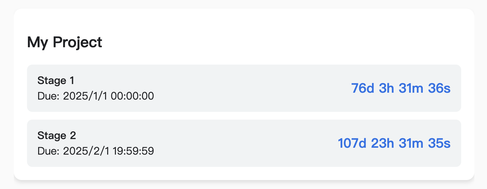

# Obsidian Countdown

A minimal countdown widget.

## Usage

````text
```countdown
Title
Stage 1 | (date in yyyy-mm-dd)T(time in hh:mm:ss)+(UTC timezone in hhmm)
...other stage
```
````

**Example:**
````text
```countdown
My Project
Stage 1 | 2025-01-01T00:00:00+0800
Stage 2 | 2025-02-01T19:59:59+0800
```
````

